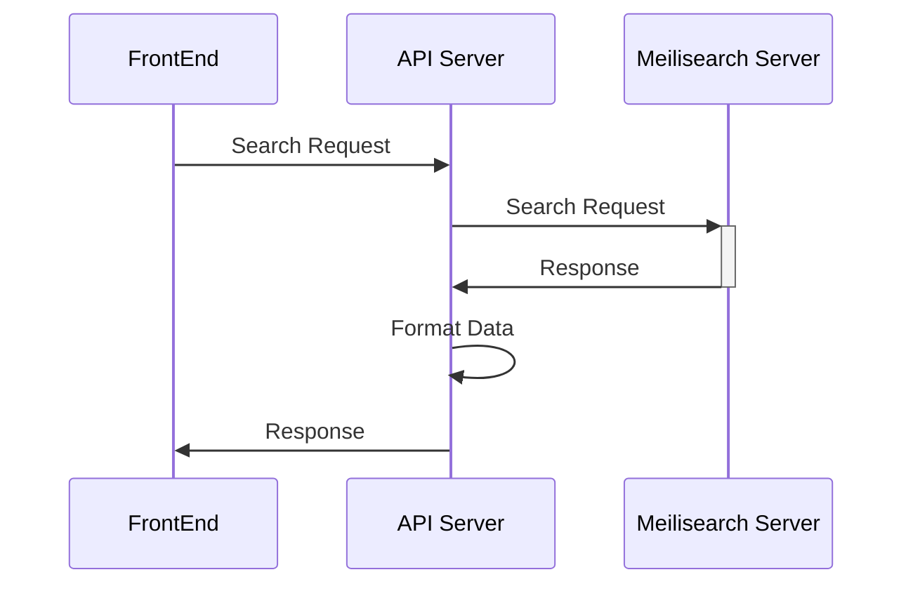

Meili 是在挪威神話中的神，指"可愛的人"，是托爾的兄弟。
---

----

###Preview

搜尋速度快、全文檢索、支援中文、容易安裝和維護


##Here We Go !


###安裝Server的方式

官方Doc有提供多種方式

我這邊使用的是Docker的方式

``` docker
#取得Docker Image
docker pull getmeili/meilisearch:v0.28

#建立Container
docker run -p 7700:7700 -d -e MEILI_MASTER_KEY='MASTER_KEY' getmeili/meilisearch
```

這邊需要提到的是 `MEILI_MASTER_KEY` 是用來設定Server的金鑰，
如果於建立Container時添加這個屬性，
未來對這個Server操作的行為都需要帶上這個金鑰。

以直接對MeiliSearch Server API Request 的情況來說就需要帶上`X-Meili-API-Key`


**流程圖**
